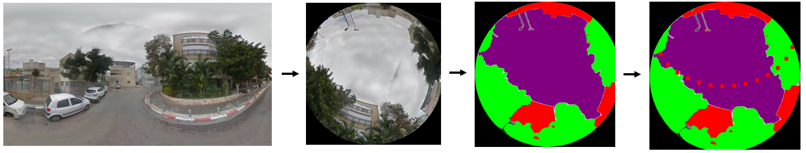

# Urban Shade Mapper



Accompanying code for the Urban Shade Mapper project for our work in Computational Learning Workshop at TAU.

This project was born out of the increasing need for shade in
urban environments. High temperatures during summer months in many cities pose a major issue for the well-being of
pedestrians, an issue that will only become more prevalent with global warming. Unfortunately, there are currently no
good and precise tools to assess where in a city there is shade and where it is sunny. As a result, cities lack the
necessary information to invest their resources efficiently into improving the shade situation.

To address this issue, the project aims to develop a digital tool for shade optimization. This tool will enable the
planning of solutions for shade provision at the street level, ultimately improving the well-being of the city's
residents. We achieve this using street-level imagery data and machine learning models that helps us assessing the shade
situation on the street.

## Installation

1. Download `sam_vit_h_4b8939` model checkpoint
   from [here](https://github.com/facebookresearch/segment-anything#model-checkpoints) and place it in
   the `shade_segment_anything` folder.
2. Start a virtual environment using `venv`:

```bash
python3 -m venv venv
source venv/bin/activate
```

3. Install requirements:

```bash
pip install -r requirements.txt
```

## Input

The program expects to receive a file named `test_points.csv`. The CSV file should be in the following format:

```csv
name,lat,lon,date_of_interest,pano_id,short_intervals
1,32.0916058,34.77306685,2023-07-18,_,Y
2,32.0915486,34.7733054,2023-07-18,_,N
3,32.0914841,34.7735563,2023-07-18,_,Y
```

where each column represents:

- `name`: index of the point
- `lat` : latitude coordinate
- `lon` : longitude coordinate
- `date_of_interest`: date of simulation in format YYYY-MM-DD
- `pano_id`: GSV panorama id (can be left blank)
- `short_intervals`: 'Y' for prediction every 10 mins, 'N' for every hour

The `test_points.csv` file should be in the same directory as `main.py`

## Running

Just run the following command:

```bash
python main.py
```

## Output

The outcome will be stored in a CSV file with following columns:

- `point`: index of the point
- `time`: time of day
- `is_shade`: shade status, 1 for yes, 0.5 for borderline, 0 for no
- `building_pixels/tree_pixels/sky_pixels`: percentage of pixels in the frame which were classified as building/tree/sky
- `nearest_pano_coordinates`: coordinates of the location we did compute from.

Please note: due to the many hours in a
day, `point`, `tree_pixels`, `building_pixels`, `sky_pixels`, `nearest_pano_coordinates` are all the same for a given
point, only time and`is_shade` values change.

The output file will look something like this:

```csv
point, time, is_shade, tree_pixels, building_pixels, sky_pixels, nearest_pano_coordinates
1, 08:00, 1, 45, 30, 25, 32.0916058,34.77306685
1, 08:10, 0.5, 45, 30, 25, 32.0916058,34.77306685
1, 08:20, 0, 45, 30, 25, 32.0916058,34.77306685
```

## Remarks

This tool provides an efficient way to predict the presence of shade for a given geographical point across different
times of the day. Always ensure that your input file is in the correct format for the best results. Happy shading!

Please open an issue if you encounter any bugs or have suggestions for further improvement. Contributions to improve
this project are welcome.